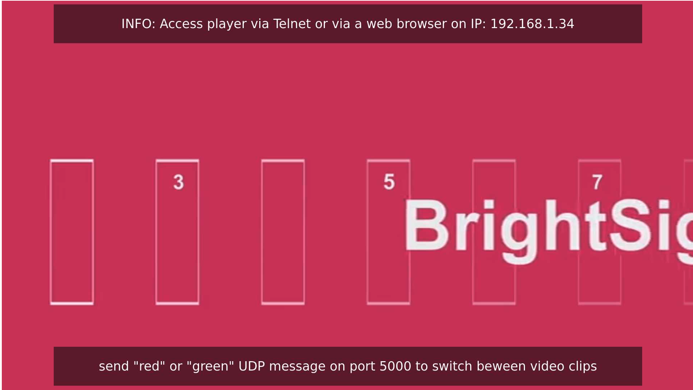

# rlb-node-app-debug-env

## Description
The package available here is a node based application that serves a site using an express server. The currently looping video can be changed by sending a UDP command on port 5000 ("red" or "green" UDP message).



This package also provide a simplified Dev environment and workflow to configure a player and setup a node based Dev environment that allows to use npm scripts automation to 
    - copy the src folder (including the autorun.brs) to the dist folder, 
    - build the bundle.js using webpack parameters, 
    - upload the dist folder to the player SD card (using bsc CLI tool),
    - use Telnet to restart the autorun/BS Application 
    
The above automation can be acheived using the below command:
```bash
npm run sync-all-build-upload-restart
```


## Features
- Feature 1
- Feature 2
- Feature 3

## Installation
To install the necessary dependencies, run the following command in your terminal:

```sh
nvm use v14.17.6 && npm install
