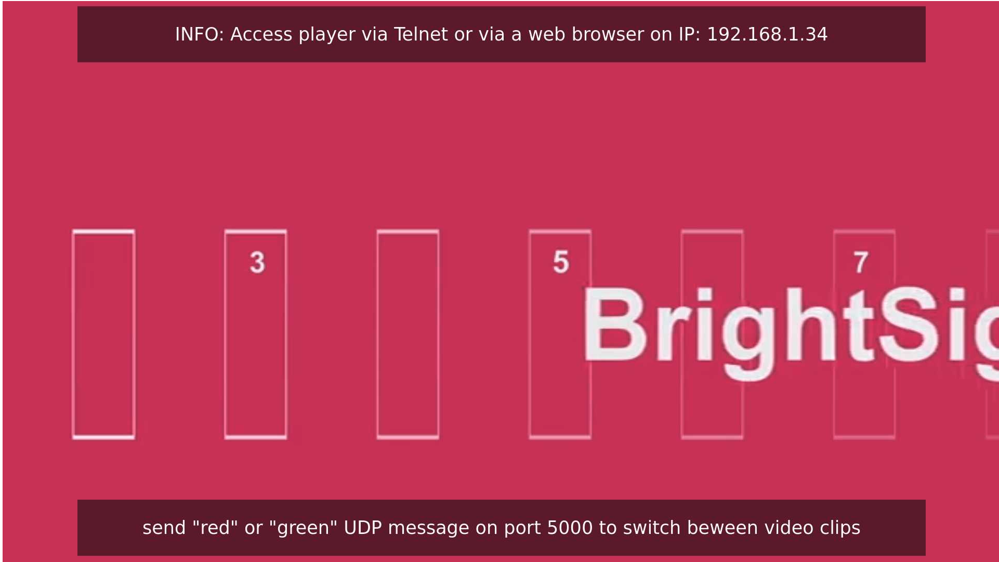
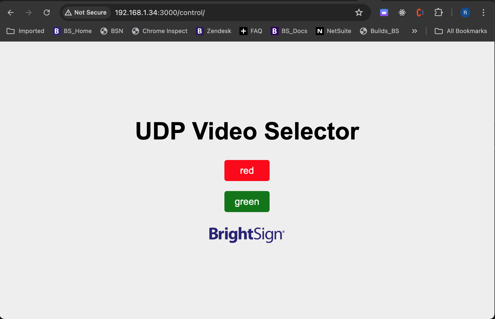
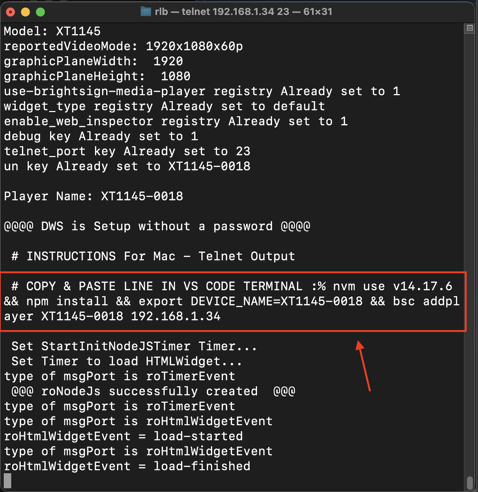
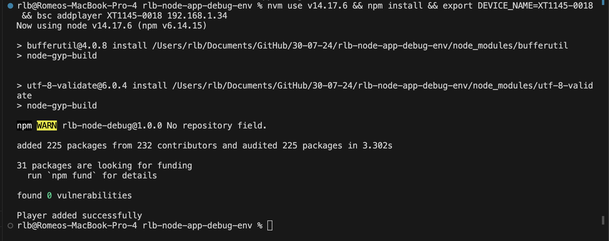
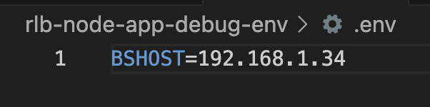
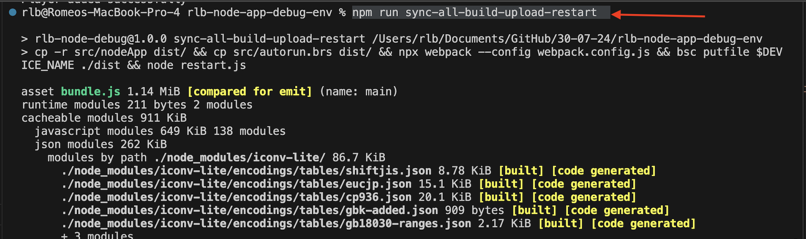
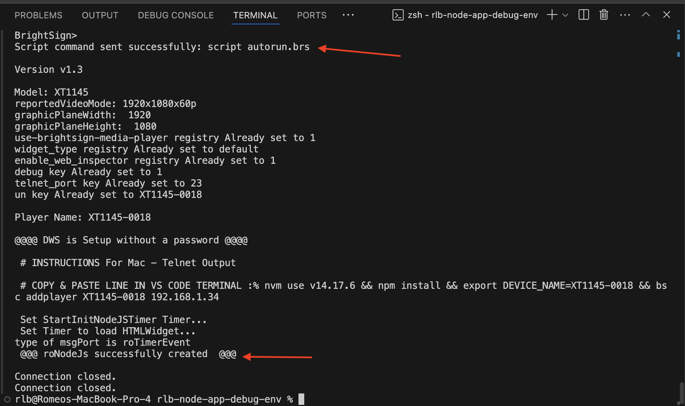
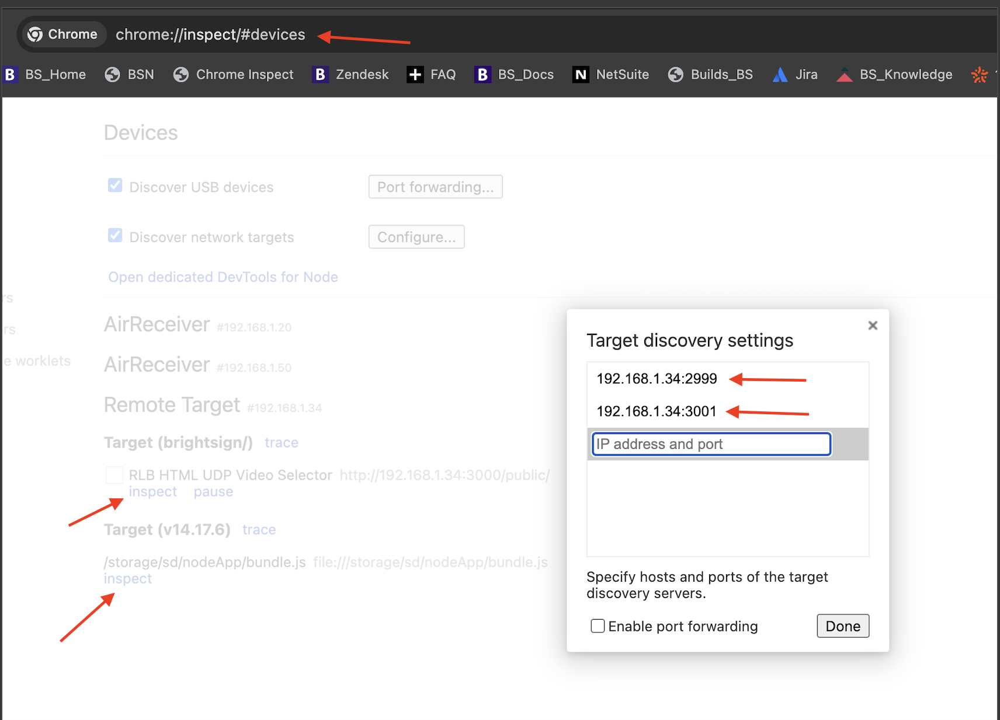
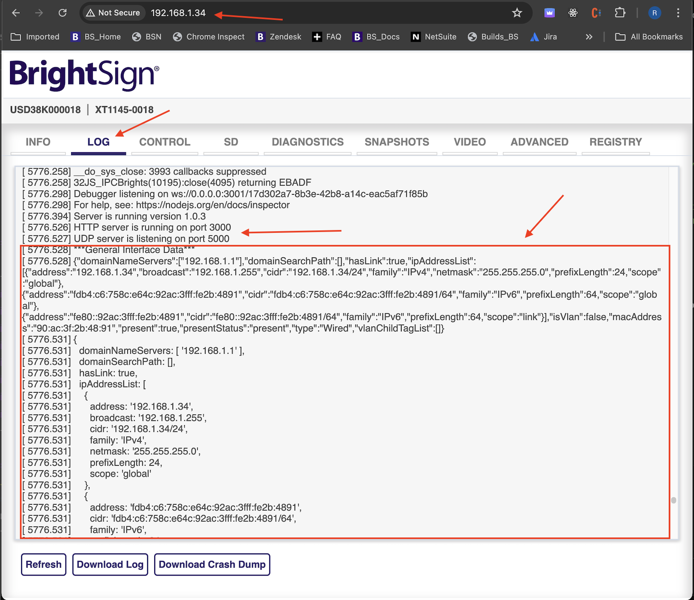
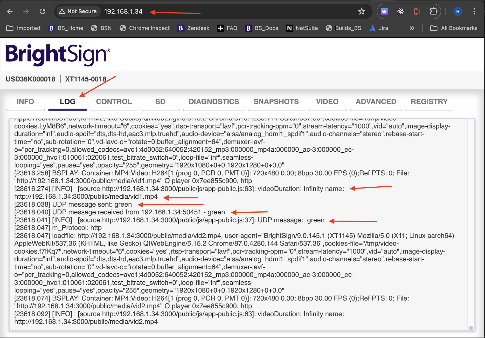

# rlb-node-app-debug-env

## Description
The package available here is a node based application that serves a site using an express server. The currently looping video can be changed by sending a UDP command on port 5000 ("red" or "green" UDP message). The backend node server communicates with the frontend roHtmlwidget using websockets.



A UDP command can be sent using any 3rd party application capable of sending UDP commands or the user may chose to send the red or green UDP command by accessing the control page via a web browser at a similar address to http://player-ip-address:3000/control



This package also provides a simplified Dev environment and workflow to configure a player and setup a node based Dev environment that allows the use npm scripts to 
- copy the src folder (including the autorun.brs) to the dist folder, 
- build the bundle.js using webpack parameters from webpack config file, 
- upload the dist folder to the player SD card (using bsc CLI tool),
- use Telnet to restart the autorun/BS Application 
    
The automation described above can be acheived using the below npm script command:
```bash
npm run sync-all-build-upload-restart
```

## Let's get started

Clone the repo onto your Mac

```bash
git clone https://github.com/RomeoLB/rlb-node-app-debug-env.git
```
change directory to the project root

```bash
cd rlb-node-app-debug-env/
```

## Player Setup

To setup the player, update the player OS with the latest version available on the website, copy the content of the dist folder to a blank SD card and insert the SD card (player should be OFF when inserting the SD card) in the player then plug the power connector to the player.

After a few reboots the player should display its IP address. Please use a Telnet client application to establish a Telnet session with the player (port 23)

In the Telnet session you should see a command that you can copy and paste in the VS Code project terminal to setup the player for the debugging environment:



See below for the setup string extracted from the Telnet session which will be used in the VS Code project to set the node version, install the node project dependencies, export the relevant environment variable for the npm script and configure the test player so it may be controlled via the Brightsign bsc cli tool:

```bash
nvm use v14.17.6 && npm install && export DEVICE_NAME=XT1145-0018 && bsc addplayer XT1145-0018 192.168.1.34
```



Locate and modify the .env file with the IP address of the player (should be displayed on screen attached to the player)



Enter the below command to verify that the src folder copy to dist folder, the webpack file bundle building, the dist folder uploading from the VS code project to the player SD card and the autorun restart do work as expected 

```bash
npm run sync-all-build-upload-restart
```



if it all worked as expected, you should see the highlighted messages (Script command sent successfully: script autorun.brs and @@@ roNodeJs successfully created  @@@ ) in the printscreen below in the console output:



# Debugging the app

You can access the Devtools console by using the Chrome web browser and entering the below url:

```bash
chrome://inspect/#devices
```
Click on the "Configure..." button to add your player IP address twice in the list. The first entry should be for port 2999 and the second entry for port 3001:



You are now ready to inspect and debug your HTML/Node application on the Brightsign player.

In addition to the info that you may get out of the DevTools console, you should also look for additional debug info in the player DWS (Diagnostic Web Server) LOG tab 





## More info to be added later...

